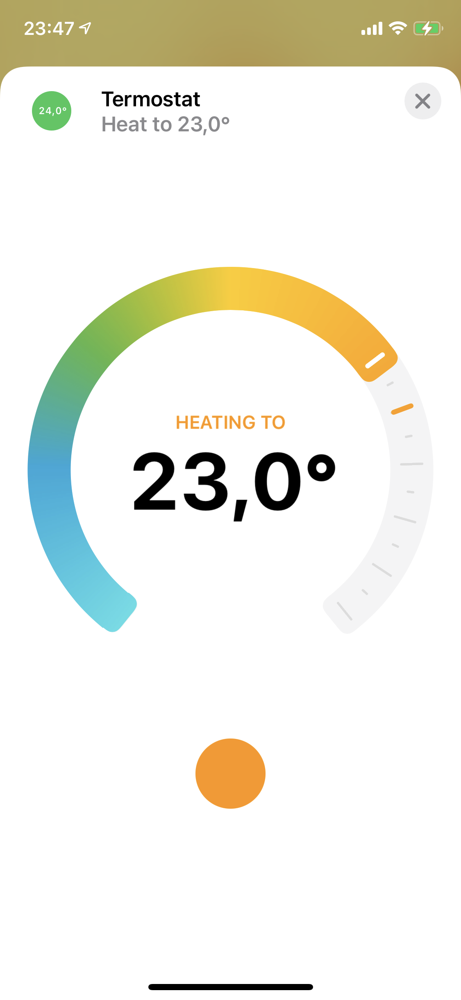

# Homebridge Pi Thermostat Plugin

This is a [homebridge](https://github.com/nfarina/homebridge) plugin to make a Raspberry Pi connected with a Relay Board and DHT22 Temperature and Humidity Sensor into a smart thermostat that can be controlled via the Home app on iOS using Homekit. This plugin only supports Heaters.

You can use homebridge config-x UI to configure this plugin.


### Configuration:

```

    {
      "accessory": "HeaterThermostat",
      "name": "Pi Thermostat",

      "relayPin": 21,
      "dhtSensorType": 22,
      "temperatureSensorPin": 4,

      "invert": false,
      "temperatureThreshold": 0.5,
      "maxTemperature": 28,
      "minTemperature": 12,
      "minimumOnOffTime": 120000, 
      "temperatureCheckInterval": 10000
    }
```

### Screenshot


